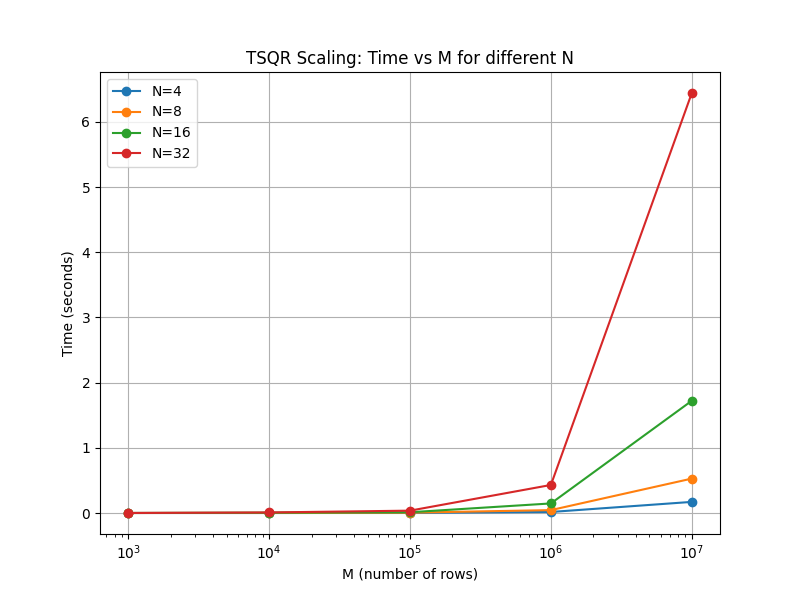

# Communication-Avoiding TSQR (Assignment Q2 & Q3)

------

## Overview

**Q2**: Implement TSQR on a tall-skinny matrix, using LAPACKE for local QR and distributing rows evenly onto four (or more) compute nodes with MPI.

**Q3**: Generate multiple random matrices with different $(m, n)$ sizes and measure how the code scales with each dimension. Record times and errors in `scaling_results.txt`, and plot them with Python.

------

## This repository contains:

```bash
├── Makefile
├── tsqr_mpi.c       # TSQR code (Q2)
├── scaling.c        # Scaling test code (Q3)
├── plot.py          # Python script for plotting
└── ...
```

1. **`tsqr_mpi.c`** (Q2):
   A **communication-avoiding TSQR** implementation in C using MPI + LAPACKE + CBLAS.

   - Demonstrates local  $QR$  factorization on sub-blocks, gathering R factors, performing a global QR, and reconstructing $Q×R$ to measure errors.
   - Can be run with default $(M, N) = (16, 4)$or user-specified dimensions (e.g., `1000 4`).

2. **`scaling.c`** (Q3):
   A **scaling test** that runs TSQR for multiple $(M,N)$  matrix dimensions, measuring performance and  errors. Results are written to `scaling_results.txt`.

3. **`plot.py`**(Q3):
   A Python script that parses `scaling_results.txt` and plots **Time vs. M** in log scale for different $N$.

4. **`Makefile`**:
   Builds the above executables (`tsqr_mpi` and `scaling`) and cleans up artifacts.

   `make clean` removes object files, executables, and `scaling_results.txt`.

------

## Dependencies

1. **MPI** 
2. **LAPACK** 
3. **Python 3** with `matplotlib` for plotting

On **macOS** with Homebrew:

```bash
brew install open-mpi openblas lapack
pip3 install matplotlib
```

------

## Build Instructions

In the `Assignment1mpi` directory, run:

```bash
make
```

When I run it, it shows as follows:

```bash
yujinhan@Yujins-MacBook-Pro A1mpi % make
mpicc -O2 -I/opt/homebrew/include -c tsqr_mpi.c -o tsqr_mpi.o
mpicc -O2 -I/opt/homebrew/include -o tsqr_mpi tsqr_mpi.o -L/opt/homebrew/lib -lopenblas -llapacke -llapack -lm
mpicc -O2 -I/opt/homebrew/include -c scaling.c -o scaling.o
mpicc -O2 -I/opt/homebrew/include -o scaling scaling.o -L/opt/homebrew/lib -lopenblas -llapacke -llapack -lm
```

This produces two executables:

- **`tsqr_mpi`** (for Q2)
- **`scaling`** (for Q3)

> **Note**: The Makefile uses `-I/opt/homebrew/include` and `-L/opt/homebrew/lib` for macOS Homebrew. 

------

## Running Q2: `tsqr_mpi.c`

1. **Default**:

   ```bash
   mpirun -np 4 ./tsqr_mpi
   ```
   
   - Uses `M=16, N=4` by default.
   - Prints partial original matrix, final R, partial reconstructed matrix, and error metrics.
   
2. **Custom Dimensions**:

   ```bash
   mpirun -np 4 ./tsqr_mpi 1000 4
   ```
   
   - For example, `M=1000, N=4` is used with 4 MPI processes.
   
     The output includes detailed information about the input matrix, TSQR execution time, the final R factor, the reconstructed matrix, and both absolute and relative errors.

### Example Output

```sql
yujinhan@Yujins-MacBook-Pro A1mpi % mpirun -np 4 ./tsqr_mpi 1000 4
Global matrix: M = 1000, N = 4

Original A (showing up to 8 rows):
    0.0966     0.8340     0.9477     0.0359 
    0.0115     0.0512     0.7658     0.5849 
    0.9141     0.7838     0.3331     0.1951 
    0.2672     0.7927     0.9839     0.1489 
    0.3391     0.0341     0.2662     0.1674 
    0.8644     0.2091     0.9167     0.2385 
    0.9303     0.9358     0.3066     0.6296 
    0.5121     0.1979     0.9107     0.3348 
  ... (total 1000 rows, truncated)
TSQR MPI Time: 0.000145 seconds

Final R (size 4x4):
   18.2057    13.6307    13.9402    14.1709 
    0.0000    11.9397     5.3839     5.0672 
    0.0000     0.0000   -10.8883    -3.5640 
    0.0000     0.0000     0.0000   -10.4693 

Reconstructed A (showing up to 8 rows):
    0.0966     0.8340     0.9477     0.0359 
    0.0115     0.0512     0.7658     0.5849 
    0.9141     0.7838     0.3331     0.1951 
    0.2672     0.7927     0.9839     0.1489 
    0.3391     0.0341     0.2662     0.1674 
    0.8644     0.2091     0.9167     0.2385 
    0.9303     0.9358     0.3066     0.6296 
    0.5121     0.1979     0.9107     0.3348 
  ... (total 1000 rows, truncated)

Final Error (absolute): 2.597479e-14
Final Error (relative): 7.068212e-16
```

### Analysis of the Results

- **Execution Time**:
  The TSQR MPI execution time for a 1000×4 matrix is very short (approximately 0.000145 seconds). This indicates that the computation (including local QR, gathering, global QR, and broadcasting) is extremely efficient when run on 4 processes.
- **Final R Factor**:
  The final R is a 4×4 upper triangular matrix, as expected from a $QR$ factorization. Its numerical values are reasonable, and while the diagonal elements might not be strictly decreasing in absolute value, the $R$ factor still meets the requirements for the factorization.
- **Reconstruction and Error**:
  The reconstructed matrix (obtained by multiplying the final $Q$ and $R$) is nearly identical to the original matrix. The **absolute error** is on the order of $10^{-14}$, and the **relative error** is around $10^{-16}$.
  These extremely small error values confirm that the TSQR implementation is both correct and numerically stable.

------

## Running Q3: `scaling.c`

The `scaling` executable is designed to test the performance and scalability of the TSQR implementation over a range of matrix dimensions. It does so by looping over predefined arrays of matrix sizes (M values) and numbers of columns (N values), executing the TSQR algorithm for each $)(M, N)$ pair, and recording both the execution time and the reconstruction error.

1. The **scaling** executable tests multiple $(M, N)$ combinations. By default, it uses:

```c
int M_values[] = {1000, 10000, 100000, 1000000, 10000000};
int N_values[] = {4, 8, 16, 32};
```

- This means the test will run for matrices with 1,000 rows up to 10,000,000 rows, and for each M, it will test with 4, 8, 16, and 32 columns.
- Uses arrays like `M_values[] = {1000, 10000, ...}` and `N_values[] = {4, 8, ...}`.

- For each valid $(M, N)$, measures time, computes absolute & relative errors, writes to `scaling_results.txt`

2. Run:

```bash
mpirun -np 4 ./scaling
```

3. It prints:

```css
Scaling results written to scaling_results.txt
```

and creates `scaling_results.txt`, containing lines like:

```markdown
TSQR Scaling Test
Number of processes = 4
-----------------------------------------------------
  M      N    Time(s)    AbsError       RelError
-----------------------------------------------------
  1000      4   0.000124   2.597e-14   7.068e-16
  1000      8   0.000025   3.513e-14   6.775e-16
  1000     16   0.000062   4.002e-14   5.464e-16
  1000     32   0.000422   9.770e-14   9.463e-16
 10000      4   0.000069   1.297e-13   1.124e-15
 10000      8   0.002059   1.029e-13   6.297e-16
 10000     16   0.003943   2.711e-13   1.173e-15
 10000     32   0.008299   4.925e-13   1.506e-15
100000      4   0.001918   1.404e-12   3.842e-15
100000      8   0.005293   3.661e-12   7.084e-15
100000     16   0.011339   3.334e-12   4.563e-15
100000     32   0.038731   6.065e-12   5.873e-15
1000000      4   0.015963   2.153e-11   1.865e-14
1000000      8   0.043655   3.181e-11   1.948e-14
1000000     16   0.170760   2.685e-11   1.162e-14
1000000     32   0.456515   3.646e-11   1.116e-14
10000000      4   0.179304   1.155e-10   3.162e-14
10000000      8   0.527360   2.625e-10   5.083e-14
10000000     16   1.864277   2.614e-10   3.580e-14
10000000     32   6.625330   6.097e-10   5.903e-14
-----------------------------------------------------
```

### Analysis of the `scaling_results.txt`

- **M, N**: Matrix dimensions
- **Time(s)**: The maximum wall-clock time among all processes (the slowest rank)
- **AbsError**: Frobenius norm of $(A - QR)$.The absolute error is computed as the Frobenius norm of the difference between the original matrix $A$ and the reconstructed matrix $QR$. This gives an idea of the overall reconstruction error in absolute terms.
- **RelError**: $\frac{\| A - QR \|_F}{\| A \|_F}$. In the tests, it remains very small (typically between $10^{-14}$ and $10^{-16}$), indicating that the factorization is numerically stable and accurate.

------

## Plotting the Scaling Results

Use the **`plot.py`** script:

```bash
python3 plot.py
```

This reads `scaling_results.txt` and plots **Time vs. M** for each N on a **logarithmic x-axis**. An example figure might look like this:



- The plot reads `scaling_results.txt` and generates a graph with a logarithmic x-axis (for M) and time on the y-axis.
- Different curves correspond to different N values (e.g., 4, 8, 16, 32), showing how execution time scales with the number of rows for each fixed column count.

### Performance Observations

- **Scaling with M**:
  As M increases, the execution time increases roughly linearly (or slightly super-linearly, depending on communication overhead) for a fixed N. This is expected, since the computational cost of the TSQR algorithm scales with the number of rows.
- **Scaling with N**:
  For a fixed M, increasing N results in a significant increase in execution time. This is because the cost of local QR is proportional to $O(M \cdot N^2)$ and the global QR (on the stacked R factors) scales roughly as $O(N^3)$.
- **Error Trends**:
  The absolute and relative errors remain low across all tests, demonstrating that the TSQR algorithm is numerically stable even for large matrices.

------

## Sample Run Instructions

1. **Compile**:

   ```bash
   make
   ```
   
2. **Run TSQR (Q2)**:

   ```bash
   mpirun -np 4 ./tsqr_mpi 1000 4
   ```
   
   - Prints partial matrices and final errors.
   
3. **Run Scaling (Q3)**:

   ```bash
   mpirun -np 4 ./scaling
   ```
   
   - Writes time/error data to `scaling_results.txt`.
   
4. **Plot**:

   ```bash
   python3 plot.py
   ```
   
   - Displays a graph of Time vs. M (log-scale) for each N.
   
5. **Clean Up**:

   ```bash
   make clean
   ```
   
   - Removes object files, executables, and `scaling_results.txt`.

------

## Notes

- My computer model is MacBook M4 pro. The running time may be related to my computer model.

- On macOS with Homebrew, we need to update library paths in the Makefile:

  ```makefile
  CC = mpicc
  CFLAGS = -O2 -I/opt/homebrew/include
  LDFLAGS = -L/opt/homebrew/lib -lopenblas -llapacke -llapack -lm
  ```
  
